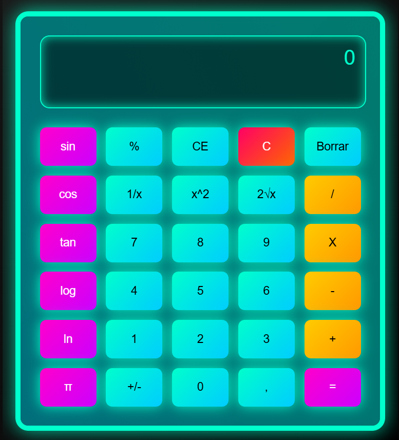

# React Calculator

A simple and interactive calculator built with React, featuring standard and scientific operations. The calculator includes a variety of mathematical functions like sin, cos, tan, logarithms, square roots, and more. Additionally, the app has sound effects that play when buttons are clicked.

**Live Demo:** [Click here to try it out!](https://eddieborbon.github.io/javascript-calculator/)

## Features ✨

- Basic arithmetic operations: `+`, `-`, `×`, `÷`
- Advanced operations: `sin`, `cos`, `tan`, `log`, `ln`, `1/x`, `x²`, `√x`, `π`, `e`
- Percentage (`%`) and inverse functions (`1/x`)
- Decimal support
- Clear (`C`), backspace (`Borrar`), and sign change (`+/-`)
- Sound effects on button click 🎵
- Responsive design for various screen sizes 📱💻

## Demo 🖥️

## How to Use 🛠️

1. Click the number buttons (0-9) to add digits to the display.
2. Use arithmetic operators (+, -, ×, ÷) to perform basic calculations.
3. Use scientific buttons for advanced calculations such as sin, cos, tan, log, and more.
4. Press `C` to clear the display, `Borrar` to delete the last digit, or `CE` to reset the display.
5. Press `=` to calculate the result of the entered expression.
6. Enjoy the clicking sound effect as you interact with the calculator! 🎶

## Installation 💻

To run the calculator locally:

1. Clone the repository:
   - `git clone https://github.com/eddieborbon/javascript-calculator.git`

2. Navigate to the project directory:
   - `cd javascript-calculator`

3. Install dependencies:
   - `npm install`

4. Start the application:
   - `npm start`

5. Open your browser and go to `http://localhost:3000` to see the calculator in action.

## Dependencies 📦

- React
- CSS (for styling)
- Audio API for sound effects

## License 📝

This project is licensed under the MIT License - see the [LICENSE](LICENSE) file for details.

---

Enjoy calculating! ⚡
